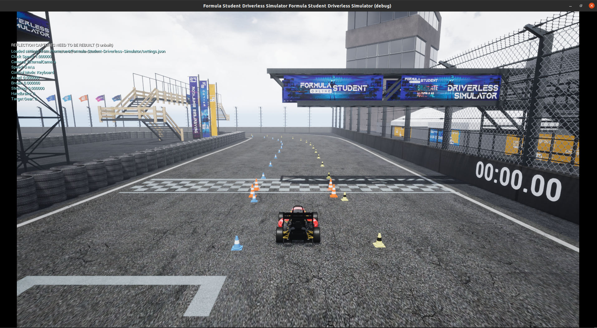
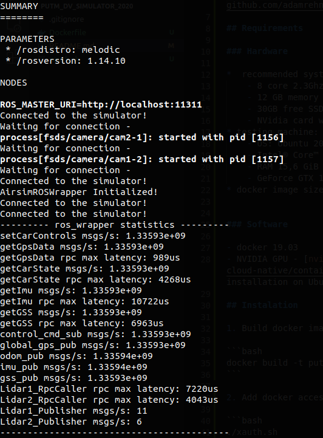
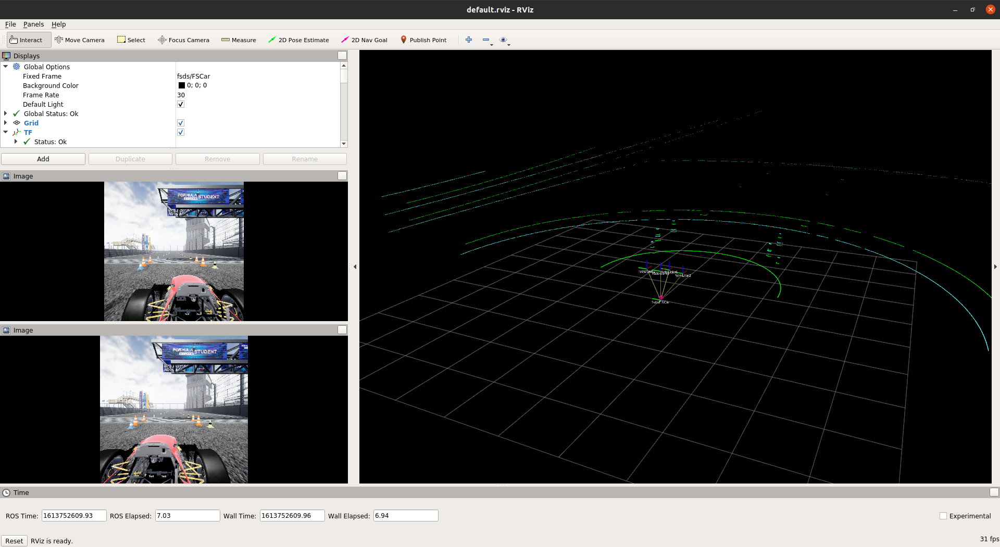
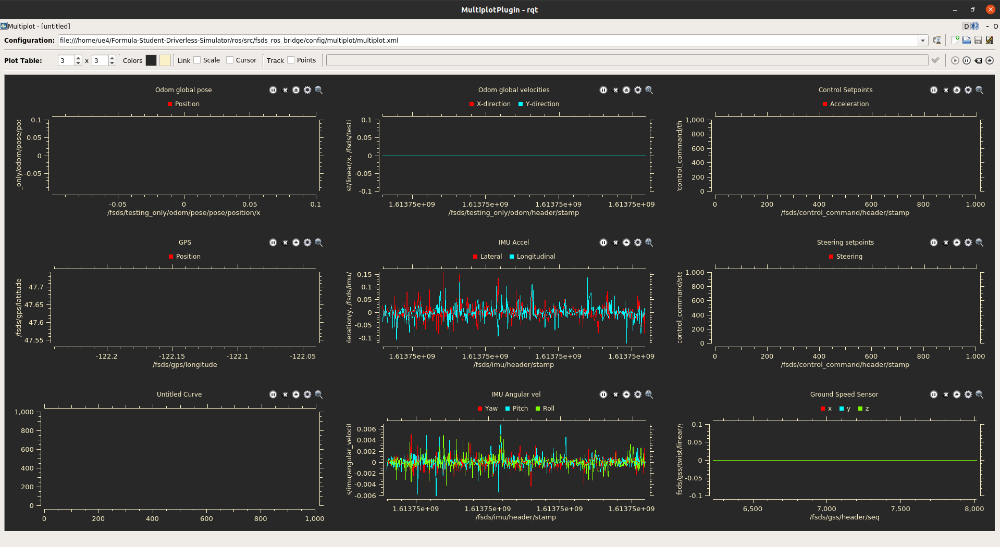

# PUT-Vision Robotics II - FSDS
Repository for Formula Student Driverless Simulator docker image.  
Based on:
- [Formula-Student-Driverless-Simulator](https://fs-driverless.github.io/Formula-Student-Driverless-Simulator/latest/getting-started/)
- [ROS-melodic](http://wiki.ros.org/melodic/Installation/Ubuntu)
- [Unreal Engine docker image with CUDA, VirtualGL and Vulkan](https://github.com/adamrehn/ue4-runtime)

## ROSbags

[Here](https://drive.google.com/drive/folders/1OaCN3RxvAE9yoHSsxjsCoKGlrzd3ZJm9?usp=sharing) are the rosbag files with a recording of the ride on two different routes.

## Requirements

### Hardware

*  recommended system requirements:
    - 8 core 2.3Ghz CPU
    - 12 GB memory
    - 30GB free SSD storage
    - NVidia card with Vulkan support and 3 GB of memory
* testing machine:
    - OS: Ubuntu 20.04.1 LTS 64-bit
    - Intel® Core™ i5-8400 CPU @ 2.80GHz × 6
    - RAM 15,6 GiB
    - GeForce GTX 1060 6GB
* docker image size is about 6 GB


### Software

- docker 19.03
- NVIDIA GPU - [nvidia-docker2](https://docs.nvidia.com/datacenter/cloud-native/container-toolkit/install-guide.html#docker) section installation on Ubuntu

## Instalation

0. Clone repository

```bash
git clone https://github.com/PUT-Motorsport/PUTM_DV_Simulator_2020.git
cd PUTM_DV_Simulator_2020
```

1. Build docker image (on testing machine build time is 13m9,531s)

```bash
docker build -t putm-fsds -f Dockerfile .
```

2. Add docker access to nvidia (it's require sudo privileges to execute)

```bash
chmod +x xauth.sh
./xauth.sh
```

3. Create directory for sharing files
```bash
mkdir $HOME/shared
```

4. Run docker image

```bash
docker run \
    -it --gpus all --privileged \
    --env="DISPLAY=:1" \
    --env="QT_X11_NO_MITSHM=1" \
    --volume="/tmp/.X11-unix:/tmp/.X11-unix:rw" \
    --env="XAUTHORITY=$XAUTH" \
    --volume="$XAUTH:$XAUTH" \
    --volume="$HOME/shared:/home/ue4/share:rw" \
    --env="NVIDIA_VISIBLE_DEVICES=all" \
    --env="NVIDIA_DRIVER_CAPABILITIES=all" \
    --network=host \
    putm-fsds
```

## User and password

* 

### The password for sudo user privileges is `ue4`.  

* 

## Tips and usage

* tips:
    - shows running containers  
    `docker ps`
    - runs a new command in a running container  
    `docker exec -it <CONTAINER ID> bash`
* usage:
    - start simulation (required):  
        `./FSDS.sh -nosound`  
        
    - start bridge between FSDS and ROS (required, but this activates the autonomous state and disables keyboard control):  
        `roslaunch fsds_ros_bridge fsds_ros_bridge.launch`  
        
    - start rviz with cameras and lidar:  
        `roslaunch fsds_ros_bridge rviz.launch`  
        
    - start window with sensors plots:  
        `roslaunch fsds_ros_bridge plot.launch`  
        
    - example control script with ROS and python:  
        `roslaunch examples sinewave.launch`
    - example control script with python client and lidar scan:
        `python3 python/examples/autonomous_example.py`
    - control using gamepad:  
        `roslaunch joystick joystick.launch`

* [topics](https://fs-driverless.github.io/Formula-Student-Driverless-Simulator/latest/ros-bridge/):
    ```bash
    $ rostopic list 
    /fsds/camera/cam1
    /fsds/camera/cam2
    /fsds/control_command
    /fsds/gps
    /fsds/gss
    /fsds/imu
    /fsds/lidar/Lidar
    /fsds/signal/finished
    /fsds/signal/go
    /fsds/testing_only/extra_info
    /fsds/testing_only/odom
    /fsds/testing_only/track
    /rosout
    /rosout_agg
    /tf_static
    ```
* services:
    ```bash
    /fsds/reset
    ```

## Errors

* DISPLAY ID
    ```
    signal 11 caught.
    Malloc Size=65538 LargeMemoryPoolOffset=65554 
    CommonUnixCrashHandler: Signal=11
    Failed to find symbol file, expected location:
    "/home/ue4/Formula-Student-Driverless-Simulator/FSOnline/Binaries/Linux/Blocks.sym"
    [2021.02.19-13.33.47:014][  0]LogCore: === Critical error: ===
    Unhandled Exception: SIGSEGV: invalid attempt to read memory at address 0x0000000000000000

    [2021.02.19-13.33.47:014][  0]LogCore: Fatal error!

    0x0000000003a2a312 Blocks!UnknownFunction(0x382a312)
    0x00000000036c2c11 Blocks!UnknownFunction(0x34c2c10)
    0x0000000003a2623e Blocks!UnknownFunction(0x382623d)
    0x00000000074b26d6 Blocks!UnknownFunction(0x72b26d5)
    0x0000000003a2a18f Blocks!UnknownFunction(0x382a18e)
    0x00007f95928a8980 libpthread.so.0!UnknownFunction(0x1297f)

    [2021.02.19-13.33.47:019][  0]LogExit: Executing StaticShutdownAfterError
    Malloc Size=131160 LargeMemoryPoolOffset=196744 
    Malloc Size=131160 LargeMemoryPoolOffset=327928 
    Malloc Size=131160 LargeMemoryPoolOffset=459112 
    Malloc Size=44522 LargeMemoryPoolOffset=503658 
    Engine crash handling finished; re-raising signal 11 for the default handler. Good bye.
    Segmentation fault (core dumped)
    ```
    Check other parameter numbers like: `--env="DISPLAY=:0"`
